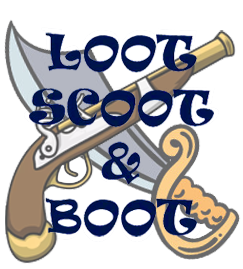
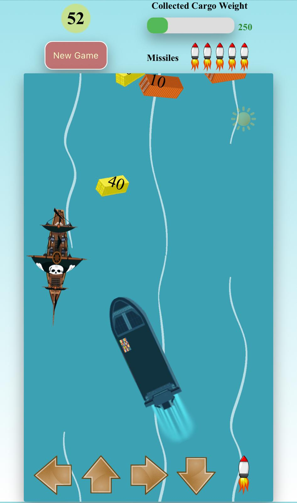

# LOOT SCOOT & BOOT Game

## Description

A cargo ship has wrecked, leaving its valuable goods scattered across the sea. Pirates are on the loose, looting them. You’ve been deployed on an armed ship with one mission: recover the target cargos before the sun sets. The race is on against time and the pirates. Will you succeed?

## Tech stack
Built with vanilla JavaScript, offering smooth and simple gameplay.

## Design
The game is designed for an immersive experience, keeping distractions to a minimum so players can focus on the action.

## Features
-	**Responsive Design**: The game is fully responsive, providing a seamless experience across different devices and screen sizes.
-	**Minimal Distractions**: The game focuses primarily on user interaction, reducing distracting elements like background images or sounds during gameplay.
-	**Personalized Welcome**: The game greets the player using the last name entered. If no name is provided, a fun, random name is assigned to the player.
-	**High Score Tracking**: The game tracks and displays the top 3 scores for each level, based on scores achieved on the same machine.
-	**Help Page**: A help page is available, providing instructions on how to play the game.
-	**Multiple Difficulty Levels**: Players can choose between 3 different difficulty levels, providing options for beginners, intermediate and experienced players.

## How to run the project
Click on the link to open the game in the browser.
*(https://nehais.github.io/loot-scoot-n-boot/)*

## How to Play
* Level selection: After loading, choose a difficulty level. The name field will auto-fill with the last player's name, or default to 'Captain NoClue' if none was entered. 
     
* Help: Click the Help button on the start screen for instructions and game backstory. 
     
* Countdown: After clicking Start, a 3-second countdown helps you adjust to the UI before gameplay begins.
* Game Elements: 
    - Timer: A 60-second timer begins once the game starts along with a shrinking sun icon to show time decreasing.
    - New Game: Restart the game at any time.
    - Progress Bar: Tracks collected cargo weight.
    - Missiles: Displays remaining missiles.
* Game Play:
    - Move the ship using arrow keys or on-screen buttons (mobile). 
     
    - Cargos with weight indication will sway by which needs to be collected.
    - Aavoid pirates. Use the spacebar or mobile buttons to shoot pirates.
        * Pirate collisions cause cargo loss.    
        * Shooting pirates rewards you with a large cargo.    
    - Avoid islands (available in harder levels); colliding with them immobilizes the ship for 5 seconds.
    - Half way through the collection, your ship will slow down.
* Winning: Collect all target cargo within 60 seconds to win. The ship docks, and a victory message appears. 
     

## Mobile Version
- Fully responsive with on-screen controls for movement and shooting. 
     